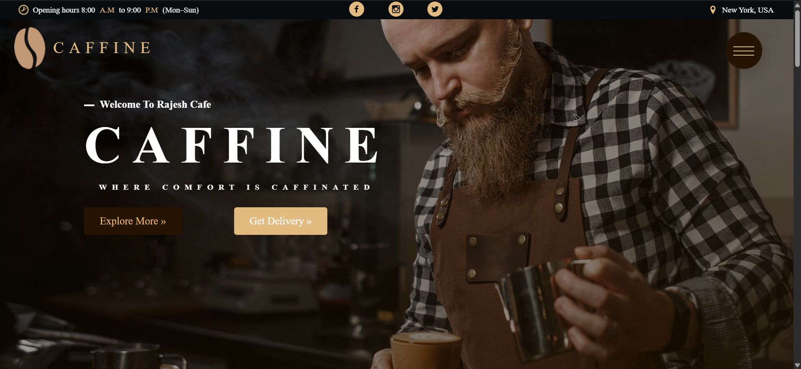
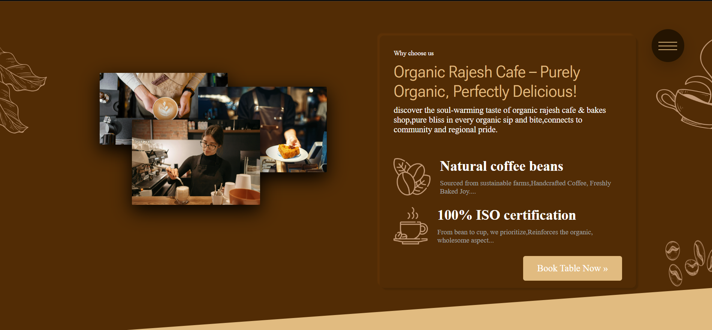

# caffeine-flex-mastery-
A high-aesthetic, desktop-first landing page for Rajesh Cafe &amp; Bakery. Engineered with advanced SASS architecture and modern Flexbox to master complex UI layouts. ☕✨

This project serves as a portfolio piece demonstrating:

- Complex layout construction using **Flexbox**.
- Advanced CSS animations and transitions.
- Scalable SASS organization (7-1 architecture).
- Clean, semantic HTML5 structure.

## ✨ Key Features

- **Animated Navigation**: A unique, full-screen overlay menu triggered by a custom-styled toggle button.
- **Dynamic Hero Section**: Interactive background animations with premium typography and clear calls to action.
- **Immersive Content**: Background video integration in the 'About' section for a modern look.
- **Menu Display**: A visual showcase of popular items with custom iconography and hover states.
- **Composition Gallery**: A sophisticated overlapping image gallery using absolute positioning and hover effects.
- **Flippable Review Cards**: Interactive customer feedback cards using CSS 3D transforms.
- **Stylized Booking Popup**: A complete booking form interface accessible via modal interaction.
- **SVG Icon System**: Optimized SVG sprite integration for high-performance iconography.

## 🛠️ Tech Stack

- **Structure**: HTML5
- **Styling**: CSS3, SASS (SCSS)
- **Concepts**: Flexbox, CSS Keyframes, BEM Methodology, SVG Sprites.

## ⚠️ Disclaimer

> **IMPORTANT**: This website is **NOT RESPONSIVE**.
> It was created specifically as a deep-dive into **Flexbox layout mechanics** and desktop-first design. It may not display correctly on mobile devices or smaller screens. It is intended for desktop viewing at standard resolutions (1920x1080 optimized).
>
> 
## 📂 Project Structure

- `/css`: Compiled production-ready CSS.
- `/sass`: Modular SCSS source files (Abstracts, Base, Components, Layout, Pages).
- `/images`: High-quality assets and SVG sprites.
- `/video`: Background video assets.
- `index.html`: Main site entry point.

---
  _Created by [Rajesh] as part of a deep learning journey into modern web design._

